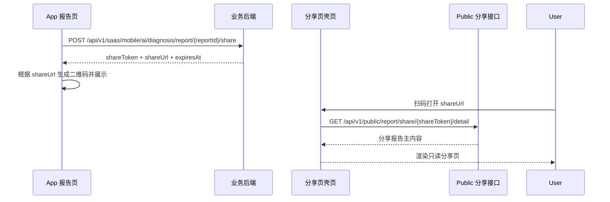

# 2026-04-28 报告二维码分享方案草案

## 1. 文档目标

本文档用于和后端对齐“报告二维码分享”能力的第一版落地方案。

这次要解决的核心问题不是“如何生成一张二维码图片”，而是：

1. 如何为一份报告生成一个可外部访问的分享链接
2. 如何用 `shareToken` 控制分享页的访问、过期和撤销
3. 如何让扫码后的分享页在**不依赖 App 登录态**的前提下，正确展示报告内容
4. 如何在当前报告页由多个模块组成的情况下，先落地一个可上线的 V1

本方案面向 **二维码分享报告**，不是“保存长图”方案。

---

## 2. 结论先行

建议按下面的思路落地：

1. App 侧点击“分享报告”
2. 前端调用“创建分享”接口
3. 后端生成 `shareToken`、`shareUrl`、过期时间等信息并返回
4. 前端根据 `shareUrl` 本地生成二维码
5. 用户扫码后，先打开一个 **SSR 壳页 / 服务端模板页**
6. 该分享页前端再调用一个 **public 分享数据接口** 拉取分享报告内容
7. 第一版分享页 **不包含“建议”模块**

这里最关键的一点是：

> **二维码只是承载形式，真正应该先定义清楚的是分享链接协议。**

也就是说，第一优先级不是“后端直接吐一张二维码图片”，而是先有一套稳定的：

- `shareToken`
- `shareUrl`
- public 访问接口
- 过期 / 撤销机制

---

## 3. 为什么不能简单把当前报告页直接公开

当前 App 内报告页并不是一个纯静态页面，也不是一个天然可外链访问的 H5 页面。

从当前前端代码看：

1. 报告主内容主要由报告详情接口加载，再转换成页面展示数据
2. “建议”模块下的项目推荐、产品推荐又会继续调其他接口
3. 当前分享按钮虽然已经存在，但现有代码仍是“二维码接口占位”状态，并没有完整的分享页协议

当前现状可以概括为：

- App 内报告页 = 私有业务页面
- 二维码分享页 = 未来新增的公共只读页面

所以不建议把“App 内现有报告路由”直接对外开放，也不建议把“扫码后直接落到原 App 内路由”当成分享方案。

分享页应该是一个单独的、只读的、无登录态依赖的公共页面。

---

## 5. 第一版范围

### 5.1 V1 包含

1. 报告分享入口
2. 创建分享链接
3. 前端生成二维码
4. 扫码打开公共分享页
5. 分享页展示报告主内容
6. 分享链接过期控制
7. 可选的分享撤销能力

### 5.2 V1 不包含

1. “建议”模块中的项目推荐
2. “建议”模块中的产品推荐
3. 登录态相关能力
4. 长图保存 / 海报生成

### 5.3 为什么 V1 先排除“建议”模块

因为“建议”模块目前不是单一数据来源，而是依赖额外接口和额外业务参数。

这部分如果放进第一版，会明显增加：

1. public 接口复杂度
2. 分享页加载时长
3. 后端实现成本
4. 线上排查复杂度

所以 V1 更适合先把“报告主内容分享”跑通，再在二期单独补“建议”模块。

---

## 6. 当前报告页的数据结构现状

从前端现状看，可以把当前报告页拆成两层理解：

### 6.1 主报告内容

主报告内容主要依赖一份报告详情数据，然后在前端做页面映射，包含：

1. 总分
2. 体质结果
3. 风险指标
4. 健康雷达相关症状
5. 舌象分析
6. 报告头图 / 说明文案 / 调理摘要等

这部分是 V1 最适合纳入分享页的内容。

### 6.2 建议模块

建议模块下至少还有两块额外动态数据：

1. 项目推荐
2. 产品推荐

这两块并不是单纯从分享链接就能直接拿到的静态内容，所以不建议在 V1 强行耦合进去。

---

## 7. 方案核心设计

### 7.1 核心原则

1. **分享对象是链接，不是二维码图片本身**
2. **public 访问用 `shareToken`，不要直接暴露原始 `reportId`**
3. **分享页是独立公共只读页，不复用 App 内私有页面**
4. **V1 先只覆盖主报告内容，不含“建议”模块**
5. **public 接口对外可以简单，但后端内部可以自由聚合多个服务**

### 7.2 为什么必须用 `shareToken`

如果直接把 `reportId` 暴露到公共 URL，会有几个问题：

1. 无法天然支持过期
2. 无法方便做撤销
3. 无法控制同一报告的多次分享
4. 公共地址可枚举风险更高

所以公共地址推荐形态为：

```text
https://{domain}/h5/report/share/{shareToken}
```

而不是：

```text
https://{domain}/h5/report/{reportId}
```

---

## 8. 整体时序



需要强调：

> 这里的 SSR 壳页不等于“服务端把整个报告完整渲染完再返回”。

它更像一个：

1. 可直接被浏览器打开的承接页
2. 带基础 SEO / 标题 / 兜底态的 HTML 页面
3. 页面初始化后再请求 public 分享数据接口

---

## 9. 推荐接口设计

### 9.1 创建分享

### 推荐接口

```http
POST /api/v1/saas/mobile/ai/diagnosis/report/{reportId}/share
```

### 是否需要 Authorization

需要。

原因很简单：创建分享是从 App 内私有报告触发的后台操作，属于“谁有权限发起分享”的问题，应该走当前登录态。

### 推荐请求体

```json
{
  "includeAdvice": false,
  "expireDays": 7,
  "shareMode": "snapshot"
}
```

字段说明：

- `includeAdvice`
  - 第一版固定传 `false`
- `expireDays`
  - 推荐默认 7 天
- `shareMode`
  - 推荐后端支持 `snapshot` / `live`
  - 第一版更推荐 `snapshot`

### 推荐响应

```json
{
  "code": 0,
  "message": "success",
  "data": {
    "shareToken": "2ab7f5f4d1b44d1d9f2dxxxx",
    "shareUrl": "https://xxx.com/h5/report/share/2ab7f5f4d1b44d1d9f2dxxxx",
    "expiresAt": "2026-05-05 23:59:59",
    "includeAdvice": false,
    "shareMode": "snapshot"
  }
}
```

### 说明

这里建议后端返回的是 **分享链接信息**，而不是直接返回二维码图片。

原因：

1. 二维码本质上只是 `shareUrl` 的一种展示方式
2. 前端自己生成二维码更灵活
3. 后续如果除了二维码还要支持“复制链接”“系统分享”“小程序跳转”，同一套 `shareUrl` 可以复用

如果后端想兼容现有前端占位接口，也可以额外保留：

```http
GET /api/v1/saas/mobile/ai/diagnosis/report/{reportId}/share/qrcode
```

但建议它内部本质上仍然先完成“创建分享链接”，而不是把“二维码图片接口”当主协议。

---

### 9.2 分享页承接路由

### 推荐路由

```http
GET /h5/report/share/{shareToken}
```

或者：

```http
GET /report/share/{shareToken}
```

### 作用

这个路由的职责是：

1. 作为扫码后的打开地址
2. 返回一个可访问的公共 HTML 壳页
3. 在页面里解析 `shareToken`
4. 再去调 public 数据接口

### 这个路由不应该做什么

1. 不要求用户登录
2. 不依赖 App token
3. 不直接暴露后台私有接口
4. 不强制要求在首个请求里把整个报告全部拼完

---

### 9.3 Public 分享明细接口

### 推荐接口

```http
GET /api/v1/public/report/share/{shareToken}/detail
```

### 是否需要 Authorization

不需要。

这个接口应该只依赖 `shareToken` 完成鉴权与数据访问控制。

### 推荐响应结构

建议这个接口返回的是“分享页所需主内容”，而不是后端内部多个原子接口的原始透传结果。

推荐形态如下：

```json
{
  "code": 0,
  "message": "success",
  "data": {
    "shareToken": "2ab7f5f4d1b44d1d9f2dxxxx",
    "expiresAt": "2026-05-05 23:59:59",
    "tabs": ["overview", "constitution", "therapy"],
    "report": {
      "reportId": "123456",
      "generatedAt": "2026-04-28 14:30:00",
      "overallScore": 82,
      "primaryConstitution": "气虚质",
      "secondaryBias": "湿热倾向",
      "summary": "整体表现为气虚夹湿热倾向，建议先做基础调理。",
      "constitutionScores": [],
      "riskIndexes": [],
      "healthRadarClassicSymptoms": [],
      "healthRadarDeepSymptoms": [],
      "tongueAnalysisItems": [],
      "heroImageUrls": [],
      "heroTherapySummary": "先规律作息，再配合基础饮食调理。"
    }
  }
}
```

### 关键建议

这个接口的重点不在于“完全复制 App 内现有所有请求”，而在于：

> **对外提供一个足够支撑分享页展示的稳定数据契约。**

后端内部可以有两种实现方式：

1. 读取分享快照
2. 通过 `shareToken -> reportId` 后再去聚合内部数据

对前端来说，只要 public 契约稳定即可。

---

## 10. 一个接口“不能完整拿到整个报告页”的问题，应该怎么理解

这是这次方案里最容易混淆的点。

如果“整个报告页”指的是：

1. App 内现有四个 tab 的所有数据
2. 包括建议模块里的动态项目推荐、产品推荐
3. 还要求完全复用当前 App 内部所有调用链

那确实，一个 public GET 很难原样直接替代。

但如果我们把分享场景重新定义成：

1. 这是一个 **公共只读分享页**
2. 第一版只展示主报告内容
3. “建议”模块先不进分享页
4. 对外返回的是分享页需要的数据模型，而不是内部接口原始结果

那么：

> **V1 完全可以用一个 public detail 接口承接分享页主内容。**

所以关键不是“一个接口能不能复刻当前全部页面内部调用”，而是：

> **我们是否接受分享页是一个独立裁剪版页面。**

本方案默认答案是：接受，而且这是第一版最合理的落地方式。

---

## 11. 推荐的数据策略：更建议做分享快照

虽然 public detail 理论上可以走“实时聚合”，但第一版更推荐 **snapshot share**。

### 11.1 snapshot 的含义

在调用“创建分享”接口时，后端把分享页所需主内容整理成一个快照，并与 `shareToken` 绑定。

之后扫码访问 public detail 时，直接读取这个快照返回。

### 11.2 为什么更推荐 snapshot

1. 分享结果稳定
2. 不受后续报告数据变化影响
3. 不依赖更多内部链路实时可用
4. public 接口更轻
5. 更容易做过期和撤销

### 11.3 如果先不做 snapshot，可以吗

可以。

如果后端更想快速落地，也可以先做：

1. `shareToken -> reportId`
2. public detail 查询时再实时取主报告详情
3. 只要返回主报告分享所需字段即可

但这条路径的代价是：

1. 分享页稳定性更依赖内部接口
2. 页面打开时延更可能波动
3. 后续字段变更时更容易牵连分享页

### 11.4 结论

推荐优先级：

1. **V1 最佳：分享快照**
2. **V1 次优：主报告内容实时聚合**

---

## 12. 分享页渲染策略建议

### 12.1 推荐形态

分享页建议是一个独立 H5 页面，特点如下：

1. 无需登录
2. 只读
3. 可被微信 / 浏览器 / 扫码工具直接打开
4. 页面内容只面向“查看报告”
5. 不提供编辑、不提供继续测评、不依赖 App 内路由上下文

### 12.2 为什么建议 SSR 壳页

原因主要有三点：

1. 扫码打开稳定
2. 能更早展示 loading / 失效页 / 标题信息
3. 比纯前端空白页首屏体验更稳

这里的 SSR 壳页可以很轻，不要求服务端直接把全部报告内容渲染出来。

### 12.3 失效态

建议分享页至少支持以下几种状态：

1. `shareToken` 不存在
2. `shareToken` 已过期
3. `shareToken` 已撤销
4. 分享数据暂时不可用

推荐让 public 接口给出明确业务错误码，方便分享页展示不同文案。

---

## 13. 二期扩展建议

等 V1 稳定后，再考虑把“建议”模块拆进分享页。

### 13.1 推荐做法

不要一开始就把所有内容继续塞回同一个 `detail` 接口，而是按模块扩展。

例如：

```http
GET /api/v1/public/report/share/{shareToken}/projects
GET /api/v1/public/report/share/{shareToken}/products
```

### 13.2 这样拆的好处

1. 主内容首屏更快
2. 建议模块失败时不会拖垮整页
3. 前后端都更好排查问题
4. 后续可以按需灰度

### 13.3 二期再决定是否保留第四个 tab

V1 如果不含建议模块，分享页可以直接做成：

1. 三个 tab
2. 或者一个纵向只读报告页

二期再决定是否恢复“建议”入口。

---

## 14. 权限、过期、撤销建议

虽然当前分享内容不涉及姓名、头像、手机号等明显隐私字段，但这不代表分享可以完全无边界。

仍然建议保留以下控制：

### 14.1 分享创建

1. 必须在登录态下发起
2. 只允许当前用户对可访问报告发起分享

### 14.2 分享访问

1. public 页无需登录
2. 仅依赖 `shareToken`
3. 需要校验状态和过期时间

### 14.3 过期时间

建议默认 7 天。

后续如果业务想更宽松，也可以改成：

1. 7 天
2. 30 天
3. 永久有效但支持手动撤销

第一版更建议从 7 天开始。

### 14.4 撤销

建议后端预留“撤销分享”能力，即便前端第一版先不做入口也可以。

原因是：

1. 后续一定可能出现“分享错人”场景
2. 撤销能力比永久裸链更稳妥

---

## 15. 与现有前端代码的对接关系

从前端现状出发，这次分享方案与现有代码的关系大致如下：

### 15.1 已有的部分

1. 报告页已有分享按钮入口
2. 当前数据层已有“获取分享二维码”的占位能力，现有占位路径是 `/api/v1/saas/mobile/physique/ai/diagnosis/report/{reportId}/share/qrcode`
3. 报告主内容已有相对清晰的数据映射模型

### 15.2 需要调整的部分

1. 现有“直接拿二维码”的接口思路建议改成“先拿 `shareUrl`”
2. App 侧改为本地根据 `shareUrl` 生成二维码
3. 新增独立的分享页地址
4. 新增 public 分享数据接口
5. V1 分享页不复用 App 内完整四 tab 逻辑

### 15.3 对后端最重要的接口交付物

如果后端先只支持下面三项，前端就可以开始接：

1. 创建分享接口
2. 分享页落地地址规则
3. public detail 接口

---

## 16. 推荐的最小可上线版本

为了控制复杂度，建议最小上线版本是：

1. App 内点击“分享报告”
2. 创建 `shareToken`
3. 返回 `shareUrl`
4. 前端生成二维码
5. 扫码打开公共 H5 分享页
6. H5 通过 `GET /api/v1/public/report/share/{shareToken}/detail` 拉取主报告内容
7. 页面只展示主报告，不展示“建议”
8. 支持过期页

这套能力跑通之后，再决定：

1. 是否补撤销入口
2. 是否补建议模块
3. 是否补复制链接 / 微信分享卡片 / 海报能力

---

## 17. 给后端需要确认的问题清单

建议和后端重点确认下面这些问题：

1. 创建分享时，后端是做 **snapshot** 还是 **live compose**
2. `shareToken` 是否一份报告可重复生成多个
3. 如果同一份报告多次分享，是复用旧 token，还是每次生成新 token
4. 默认过期时间是 7 天、30 天还是永久
5. 是否需要“撤销分享”接口
6. 分享页正式域名是什么
7. public detail 接口是否由后端做聚合返回
8. V1 是否确认不包含“建议”模块
9. 二期如果补“建议”，是否拆成独立接口
10. 是否保留现有 `/share/qrcode` 兼容接口，还是直接切成“创建分享 + 前端本地生成二维码”

---

## 18. 本方案最终建议

如果目标是“尽快把二维码分享落地，并且控制首版复杂度”，那么最推荐的方案是：

1. **重新定义正式的分享协议，不依赖 `saveReportUrl` 现状**
2. **先做 share link，再做二维码**
3. **扫码先落到独立公共分享页，不直接暴露 App 内报告页**
4. **V1 只做主报告内容，不做建议模块**
5. **public 接口对外只暴露分享页所需数据，不要求复刻内部所有原子接口**
6. **优先使用 `shareToken + snapshot` 模式**

一句话总结就是：

> **二维码分享的本质不是“生成一张码”，而是“建立一条可控、可过期、可承接的公共报告访问链路”。**
